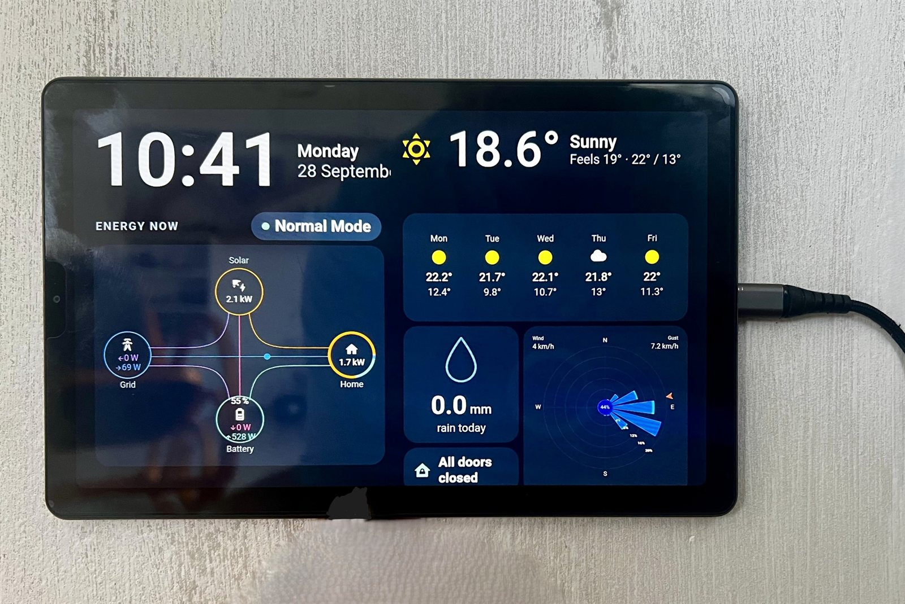
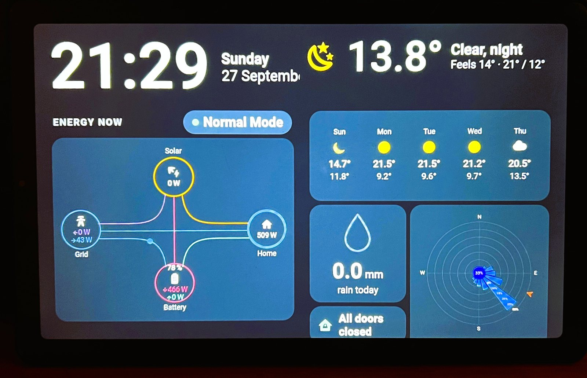

# Kiosara

**Turns an Android tablet into a Home Assistant wall panel that looks after its own battery: charged between 40 and
80 % through a smart plug, so it can hang on the wall for years without swelling.**

> **Beta (v0.9.0):** in active testing; running daily on the author's wall panel. Expect rough edges and please
> [report them](https://github.com/andy-walker-idfa/kiosara/issues/new/choose).

> **Not affiliated with or endorsed by Home Assistant or the Open Home Foundation.**
> "Home Assistant" is used only to describe what this app works with.

<p>
  
  
</p>

*The author's panel on a Lenovo Tab M9, by day and in the evening. The same layout is available as an
[example dashboard](homeassistant/examples/dashboard.yaml) with a [dark theme](homeassistant/themes/kiosara.yaml).*

## What it does

Kiosara is a home appliance, not a kiosk platform: it does one job and has only the settings a normal household
needs.

- **Shows your dashboard, full screen and always on.** It is the tablet's Home app, starts after a reboot, keeps
  the Home Assistant login, and shows a friendly retry screen instead of browser errors.
- **Protects the battery.** A Home Assistant blueprint switches the charger's smart plug to keep the battery
  between 40 and 80 %, with overheat protection, emergency charging and a fail-safe if the tablet goes offline.
- **Sleeps at night.** From a time you choose the screen is black and the dashboard goes back to its start page; a
  touch shows the dashboard for a minute without triggering anything on it.
- **Runs by itself.** Reloads after network outages, repairs a frozen or disconnected page, and restarts itself
  after a crash.
- **Optional Home Assistant integration (MQTT discovery)** with deliberately few entities: battery, battery
  temperature, night mode, screen brightness and reload.
- **Optional kiosk lock** (Android device owner + Lock Task Mode, set up once over adb) keeps the dashboard in front,
  with PIN-protected escape hatches and a documented way back at every step.
- Brightness that follows Android or is fixed, adjustable text size, optional settings PIN, local log viewer,
  English and Czech.

Deliberately not included: camera or microphone use, motion detection, text-to-speech, a local web server or REST
API, remote settings changes.

## Quick start

1. **Tablet:** Android 10 or newer, on your home Wi-Fi. Update *Android System WebView* in the Play Store (it shows
   the dashboard).
2. **App:** download the APK from [Releases](https://github.com/andy-walker-idfa/kiosara/releases), check its
   SHA-256 against `SHA256SUMS`, install it, open it and choose it as the **Home app** when Android asks.
3. **Dashboard:** enter your Home Assistant address (e.g. `http://192.168.1.10:8123/`) on the "Not set up yet"
   screen and log in, ideally as a separate **non-admin** Home Assistant user.
4. **Home Assistant (optional, recommended):** set up MQTT and connect the app, then import the charging blueprint:

   [](https://my.home-assistant.io/redirect/blueprint_import/?blueprint_url=https%3A%2F%2Fgithub.com%2Fandy-walker-idfa%2Fkiosara%2Fblob%2Fmain%2Fhomeassistant%2Fblueprints%2Fautomation%2Fshdash%2Fbattery_charge_management.yaml)

5. **Optional:** night mode, settings PIN and kiosk lock.

Settings open with **5 quick taps in the top-right corner**. The full guide, step by step:
**[docs/home-assistant-setup.md](docs/home-assistant-setup.md)**. An example dashboard (clock, weather, solar and battery
flow, rain, doors, wind rose) and a dark theme are in [homeassistant/examples/](homeassistant/examples/dashboard.yaml) and
[homeassistant/themes/](homeassistant/themes/kiosara.yaml).

The APK is signed with this certificate (SHA-256):
`22:43:24:3E:9A:54:83:91:22:A5:D8:B6:0D:A9:ED:0B:4E:66:D3:C8:CE:84:3C:CE:F9:7B:CB:59:E1:90:90:F0`

## Kiosara or Fully Kiosk Browser?

[Fully Kiosk Browser](https://www.fully-kiosk.com/) is the established choice for Android wall panels and a
mature, capable product. An honest comparison:

| | Kiosara | Fully Kiosk Browser |
|---|---|---|
| Licence | Open source (Apache 2.0) | Proprietary; many advanced features need a paid licence per device |
| Scope | One job: a Home Assistant dashboard, deliberately few settings | General-purpose kiosk browser with a very large feature set |
| Battery care | Built in: charge-guard blueprint with overheat protection | Possible with your own automations |
| Home Assistant | MQTT discovery with five entities | Rich integration (official HA integration, many sensors and controls) |
| Camera, motion detection, TTS, remote admin | No (by design) | Yes |
| Maturity and device coverage | Beta, tested on one tablet model | Many years, very many devices |
| Support | Home project, best effort | Commercial product |

If you need its features or its track record, use Fully Kiosk. If you want a small, open-source app that keeps a
Home Assistant panel on the wall with a healthy battery, try Kiosara.

## Known limitations

- **Beta:** tested daily on one tablet model (see below); other devices may behave differently.
- **Links on the dashboard can lead to other websites**, even with the kiosk lock on: the lock keeps the app in
  front, not the browser on your dashboard. Keep external links off the panel's dashboard.
- Home Assistant over plain `http://` and MQTT without TLS are unencrypted on your home network; MQTT over TLS is
  not supported yet. See the [security notes](docs/home-assistant-setup.md#11-security-notes).
- Android System WebView updates only through the Play Store, which needs a Google account on the tablet.
- After an app update the dashboard comes back by itself only when the app is device owner (kiosk lock set up);
  otherwise open it once.
- Aggressive battery management on some tablets can stop the background connection; see
  [dontkillmyapp.com](https://dontkillmyapp.com).
- No self-updater yet (planned after v1.0); update by installing the new APK.

## Tested devices

| Device | Android | WebView | Status | Notes |
|---|---|---|---|---|
| Lenovo Tab M9 (TB310FU) | 13 | 153 | Daily use | Reference device; kiosk lock verified |

Tried it on another tablet? Please send a
[device report](https://github.com/andy-walker-idfa/kiosara/issues/new/choose), whether it worked or not.

## Support

Kiosara is a home project with **best-effort support**: issues are read and fixed when time allows, and there are
no guarantees. Bugs and device reports: [issues](https://github.com/andy-walker-idfa/kiosara/issues). Security
problems: see [SECURITY.md](SECURITY.md) (please report privately).

## Build from source
Requirements: JDK 21 and the Android SDK (platform 37). The Gradle wrapper downloads Gradle.
```sh
./gradlew assembleGithubRelease   # sideload build (unsigned unless keystore.properties exists)
./gradlew assembleStoreRelease    # F-Droid / store build: no self-updater (planned), no install permission
./gradlew testGithubDebugUnitTest testStoreDebugUnitTest lintGithubDebug lintStoreDebug ktlintCheck
```
There are two build flavors:
- `github`: for sideloading from GitHub releases. It will contain the self-updater.
- `store`: for F-Droid, IzzyOnDroid and Google Play. It has no updater and asks for battery-optimization
  changes through the system settings screen.

Release builds are designed to be reproducible (no build timestamps, VCS info or dependency-metadata blobs).

## Privacy
The app collects no data and contains no analytics, crash reporting or third-party services. It talks
only to your own Home Assistant and your own MQTT broker; Android's web view may use Google Safe Browsing. See
[PRIVACY.md](PRIVACY.md).

## License
Apache License 2.0; see [LICENSE](LICENSE). Third-party components: [THIRD_PARTY_NOTICES.md](THIRD_PARTY_NOTICES.md).
Changes: [CHANGELOG.md](CHANGELOG.md).

Kiosara is not affiliated with Fully Kiosk Browser or its makers; the name is used only for comparison.
